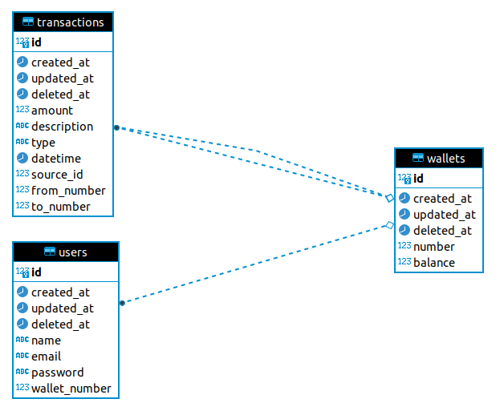
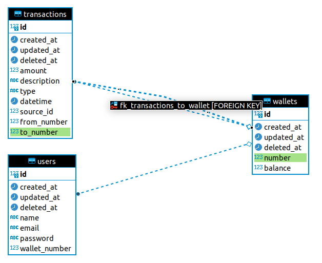
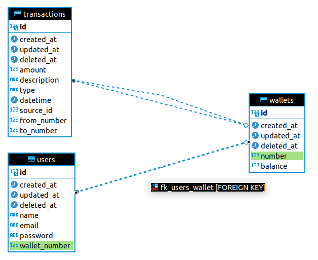
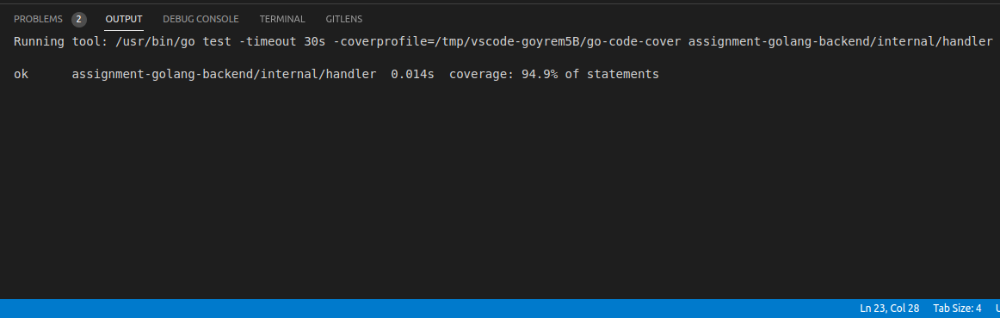
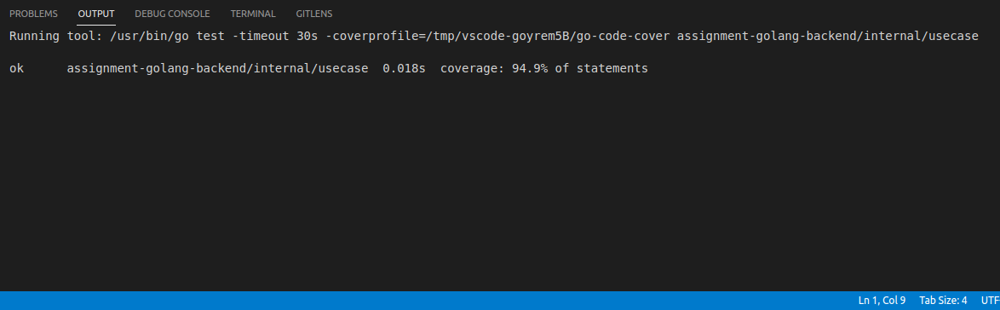

# assignment-golang-backend

Created by Tafia Alifianty Dinita Putri
## Description
This is an API documentation for E-Wallet Backend.

## How to Setup
1. Copy the script from `asset/wallet_db_tafia.sql` to postgresql terminal to seed the database
2. Create `.env` file with your appropriate environment settings

## How to Run
1. Install nodemon package [https://www.npmjs.com/package/nodemon]
2. Run `make dev-run` in terminal to start the API Program.
3. Open [swagger link](http://localhost:8080/docs) [http://localhost:8080/docs] in your browser and try the API endpoint from there.

## ERD

## Unit Testing
Coverage:
- Handler: 94.9%
- Usecase: 94.9%

## Future Improvement
- API for reset password
- Unit test coverage not 100%
- SQL Mock for repository
